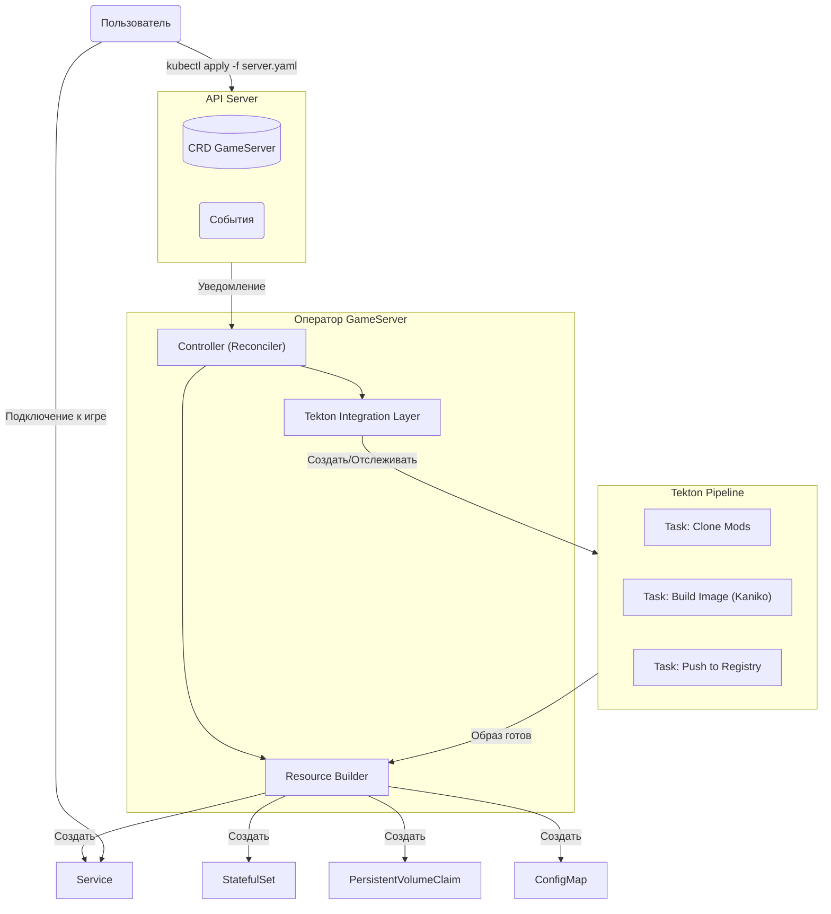
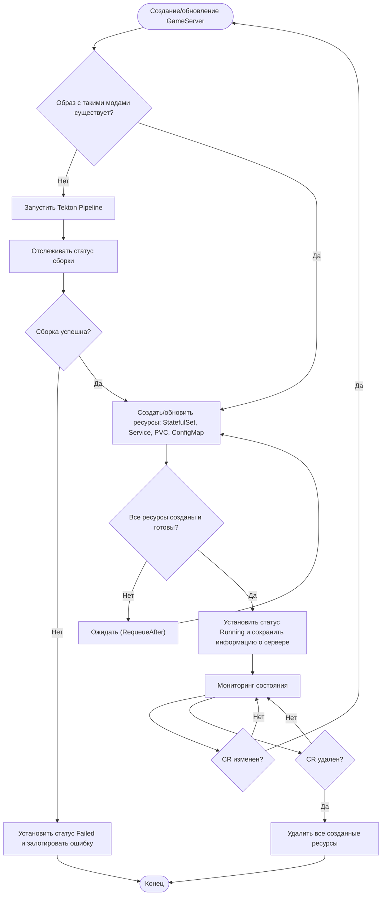
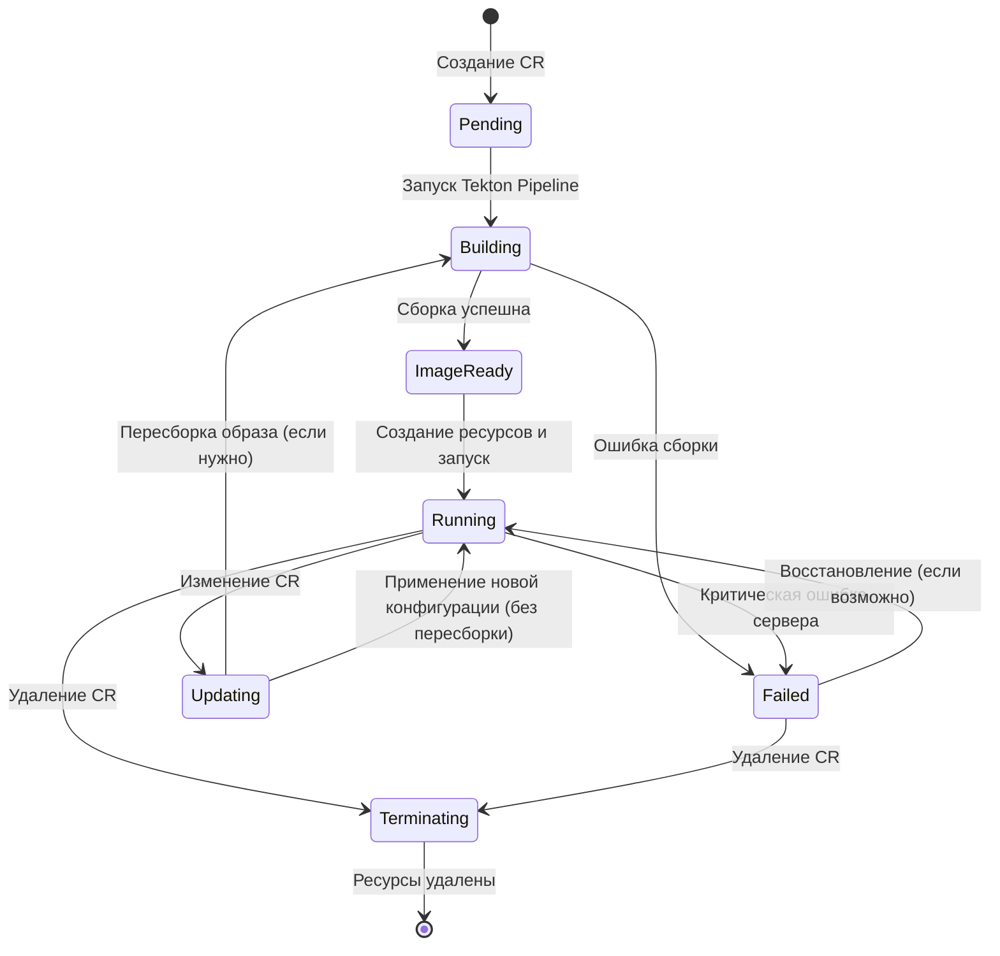
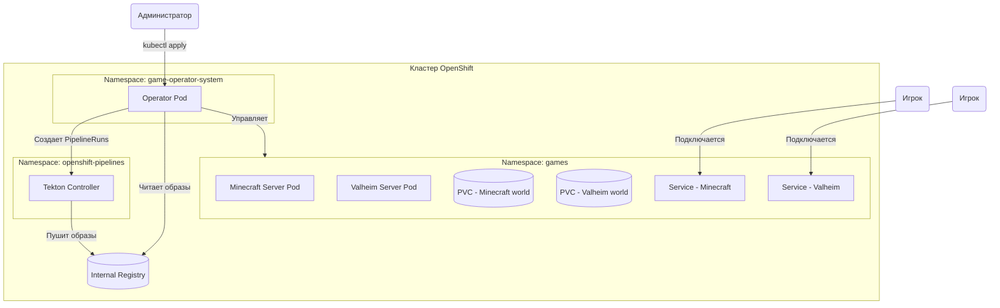

---
cssclasses:
  - file-width1200px
---
Отлично! Вот полностью переработанный **Проектный раздел** в соответствии с вашей структурой. Я наполнил его конкретным содержанием для вашего Kubernetes-оператора, адаптировав стандартные пункты к специфике разработки оператора (например, "база данных" заменена на CRD, "интерфейс пользователя" — на YAML-манифесты). Для схем использован синтаксис Mermaid.

---

# 2. ПРОЕКТНЫЙ РАЗДЕЛ

## 2.1. Проектирование мультимедиа приложения

### 2.1.1. Проектирование архитектуры ИС/модуля ИС/АРМ

Разрабатываемый Kubernetes-оператор предназначен для автоматизации развертывания серверов многопользовательских игр, которые являются ключевым компонентом мультимедийной инфраструктуры. Архитектура оператора построена на основе паттерна **Controller** и расширяет функциональность Kubernetes через механизм Custom Resource Definitions (CRD).

**Концептуальная архитектура**

Система состоит из следующих основных компонентов:
1.  **Custom Resource Definition (CRD) `GameServer`** — расширяет Kubernetes API, позволяя пользователям описывать желаемое состояние игрового сервера в декларативном YAML-манифесте.
2.  **Controller (Reconciler)** — основной компонент, реализующий управляющий цикл. Постоянно следит за состоянием ресурсов `GameServer` и приводит фактическое состояние кластера к состоянию, описанному в CR.
3.  **Tekton Integration Layer** — модуль, отвечающий за взаимодействие с Tekton API для запуска пайплайнов сборки образов и отслеживания их статуса.
4.  **Resource Builder** — компонент, создающий и обновляющий дочерние Kubernetes-ресурсы (StatefulSet, Service, PVC, ConfigMap) на основе параметров из CR.

**Схема архитектуры (на Mermaid)**



**Описание взаимодействия компонентов:**

1.  Пользователь создает ресурс `GameServer` через `kubectl apply`.
2.  API Server сохраняет CR и генерирует событие.
3.  Controller получает уведомление и запускает цикл примирения (reconcile loop).
4.  Если для данной конфигурации (игра + версия + моды) еще нет образа, Controller через Tekton Layer создает PipelineRun.
5.  Tekton Pipeline выполняет сборку образа (скачивание модов, запуск Kaniko, пушинг в registry).
6.  После успешной сборки Controller получает имя образа, и Resource Builder создает необходимые ресурсы: StatefulSet (сам сервер), Service (доступ), PVC (хранилище), ConfigMap (конфигурация).
7.  Пользователь подключается к серверу через IP и порт, предоставленные Service.

### 2.1.2. Проектирование функциональной схемы ИС/модуля ИС/АРМ

Функциональная схема описывает основные процессы, выполняемые оператором, и потоки данных между ними.



**Основные функции системы:**
1.  **Управление CRD** — прием и валидация пользовательских манифестов.
2.  **Управление сборкой** — запуск пайплайнов Tekton для создания кастомных образов.
3.  **Управление ресурсами** — создание и обновление StatefulSet, Service, PVC, ConfigMap.
4.  **Мониторинг состояния** — отслеживание здоровья сервера и реакции на изменения CR.

### 2.1.3. Проектирование логической и физической модели базы данных

В классическом понимании оператор не использует внешнюю базу данных. Вся информация о состоянии системы хранится непосредственно в Kubernetes как часть etcd. Роль "базы данных" выполняют:
*   **Custom Resource (CR) `GameServer`** — хранит желаемое состояние.
*   **Статус CR (`status`)** — хранит фактическое состояние и метаинформацию (например, имя собранного образа).
*   **Дочерние ресурсы (StatefulSet, PVC и др.)** — хранят информацию о запущенных экземплярах.

**Логическая модель данных (структура CRD)**

*   **Сущность:** `GameServer` (имя, namespace).
*   **Атрибуты (Spec — желаемое состояние):**
    *   `game.type` (string) — тип игры (minecraft, valheim, csgo).
    *   `game.version` (string) — версия сервера.
    *   `mods[]` (array) — список модов:
        *   `name` (string) — название.
        *   `source.url` (string) — URL для скачивания.
        *   `destination` (string) — путь монтирования.
    *   `config` (map) — произвольные пары ключ-значение для конфигурации.
    *   `resources` (object) — requests/limits CPU и памяти.
    *   `storage.size` (string) — размер PVC.
    *   `network.ports[]` (array) — список портов.
*   **Атрибуты (Status — фактическое состояние):**
    *   `phase` (string) — фаза (Pending, Building, Running, Failed).
    *   `buildInfo.image` (string) — имя собранного образа.
    *   `serverInfo.address` (string) — адрес для подключения.
    *   `conditions[]` (array) — массив условий (Ready, BuildComplete).

**Физическая модель:**
Физически данные хранятся в etcd — распределенном key-value хранилище Kubernetes. CRD регистрируются в API Server, и все экземпляры `GameServer` сериализуются в JSON и сохраняются в etcd. Для доступа к данным оператор использует client-go библиотеку.

### 2.1.4. Проектирование модели жизненного цикла ИС/модуля ИС/АРМ

Модель жизненного цикла ресурса `GameServer` описывает состояния, через которые проходит сервер от создания до удаления.



**Описание фаз:**
1.  **Pending** — CR создан, ожидается обработка.
2.  **Building** — идет сборка образа в Tekton.
3.  **ImageReady** — образ собран, готов к развертыванию.
4.  **Running** — сервер запущен и работает.
5.  **Updating** — процесс обновления конфигурации.
6.  **Failed** — ошибка на одном из этапов.
7.  **Terminating** — ресурс удаляется.

### 2.1.5. Макет дизайна интерфейса пользователя

Для оператора, управляемого через Kubernetes API, основным интерфейсом пользователя являются **YAML-манифесты** и стандартные CLI-инструменты (`kubectl`, `oc`). Это соответствует парадигме "инфраструктура как код" (Infrastructure as Code).

**Макет интерфейса (пример манифеста):**

```yaml
apiVersion: gaming.example.com/v1alpha1
kind: GameServer
metadata:
  name: my-minecraft-with-mods
  namespace: games
spec:
  game:
    type: "minecraft"
    version: "1.20.1"
    edition: "forge"  # Используем Forge для модов

  mods:
    - name: "jei"  # Just Enough Items
      source:
        url: "https://modrinth.com/mod/jei/version/15.0.0.68"
    - name: "worldedit"
      source:
        url: "https://dev.bukkit.org/projects/worldedit/files/latest"

  config:
    maxPlayers: 20
    difficulty: "hard"
    motd: "Welcome to modded Minecraft!"

  resources:
    requests:
      memory: "4Gi"
      cpu: "2"
    limits:
      memory: "6Gi"
      cpu: "4"

  storage:
    size: "20Gi"

  network:
    type: "NodePort"
    ports:
      - name: "game"
        containerPort: 25565
        protocol: "TCP"
```

**Интерфейс для мониторинга (статус):**

После применения манифеста пользователь может получить статус:

```bash
$ kubectl get gameserver my-minecraft-with-mods -o yaml
```

Ответ содержит статус:

```yaml
status:
  phase: "Running"
  buildInfo:
    image: "image-registry.openshift-image-registry.svc:5000/games/minecraft-server:abc123"
  serverInfo:
    address: "node-1.example.com:30015"
    playerCount: 3
```

**Web-интерфейс (опционально, для расширения):**
В качестве дополнительного интерфейса может быть разработана простая веб-панель, отображающая список серверов и их статус. Однако в рамках данной работы это не является обязательным, так как полный функционал доступен через `kubectl`.

## 2.2. Выбор технологий реализации ИС/модуля ИС/АРМ

### 2.2.1. Выбор технологий реализации

Выбор технологий обусловлен требованиями к интеграции с целевой платформой (OpenShift) и спецификой разработки Kubernetes-операторов.

| Компонент | Технология | Обоснование выбора |
|-----------|------------|---------------------|
| **Язык программирования** | Go | Стандарт де-факто для разработки Kubernetes-операторов. Наличие богатых библиотек: client-go, controller-runtime, kubebuilder. Высокая производительность и статическая типизация. |
| **Фреймворк для оператора** | Kubebuilder | Рекомендуемый инструмент для создания операторов. Генерирует скелет проекта, управляет CRD, webhook'ами и RBAC. Тесно интегрирован с controller-runtime. |
| **CI/CD движок** | Tekton | Нативный для OpenShift CI/CD-фреймворк. Позволяет запускать пайплайны сборки внутри кластера без необходимости во внешних CI-системах. Поддерживает кастомные задачи и интеграцию с registry. |
| **Сборка образов** | Kaniko (через Tekton) | Позволяет собирать Docker-образы внутри кластера Kubernetes без доступа к docker daemon (безопасно для мультитенантных сред). Работает без привилегированных контейнеров. |
| **Хранилище данных** | etcd (встроенное в K8s) | Не требуется внешняя БД. Все состояние оператора хранится в etcd через механизм CRD. |
| **Мониторинг** | Prometheus client | Стандартная библиотека для экспорта метрик в Prometheus. Легко интегрируется с мониторингом OpenShift. |
| **Тестирование** | envtest (из controller-runtime) | Позволяет запускать интеграционные тесты с реальным etcd и API Server в изолированной среде. |

### 2.2.2. Используемые классификаторы и системы кодирования мультимедиа информации

Для обеспечения совместимости с различными игровыми серверами и модами используются стандартные подходы к кодированию и классификации мультимедийных данных:

1.  **Типы игр (классификатор):** В CRD используется строковый идентификатор типа игры (например, `minecraft`, `valheim`, `csgo`). В дальнейшем возможно расширение до managed-ресурса `GameType`, который будет хранить шаблоны конфигурации для конкретной игры.

2.  **Идентификация версий:** Используется семантическое версионирование (SemVer) для указания версий игр и модов (например, `1.20.1`, `15.0.0.68`).

3.  **Кодирование конфигурации:** Все параметры конфигурации передаются либо как переменные окружения (стандартный способ для 12-factor приложений), либо как файлы в ConfigMap. В обоих случаях используется кодировка UTF-8.

4.  **Хранение мультимедийных данных:**
    *   **Моды и карты:** Хранятся как бинарные файлы (jar, zip, pk3) в Docker-образе или загружаются через Init-контейнеры.
    *   **Игровые миры:** Сохраняются в PVC. Файловые системы внутри контейнеров используют кодировки, специфичные для игры (чаще всего UTF-8 для текстовых файлов и бинарные форматы для данных мира).

### 2.2.3. Нормативно-справочная и входная информация

**Входная информация:**
1.  **Пользовательские манифесты YAML:** Содержат описание желаемого состояния сервера (см. раздел 2.1.5). Валидируются на уровне CRD (OpenAPI schema) и, опционально, через validating webhook'и.
2.  **URL источников модов:** Ссылки на файлы модов (обычно прямые ссылки на скачивание с платформ Modrinth, CurseForge, BukkitDev).
3.  **Конфигурационные файлы игр:** Могут быть переданы как часть ConfigMap.

**Нормативно-справочная информация (условно):**
1.  **Базовые Docker-образы:** Хранятся во внутреннем registry OpenShift или публичных registry (Docker Hub, Quay.io). Используются как основа для сборки кастомных образов.
2.  **Шаблоны Tekton Pipelines:** Предопределенные `Pipeline` и `Task`, используемые для сборки. Могут быть переопределены пользователем.
3.  **RBAC-правила:** Определяют, какие действия оператор может выполнять в кластере.

## 2.3. Математическое и техническое обеспечения ИС/модуля ИС/АРМ

### 2.3.1. Математическое обеспечение приложения

Разрабатываемый оператор не требует сложных математических вычислений или статистической обработки данных в своей основной логике. Однако для обеспечения эффективной работы и дальнейшего расширения могут быть использованы следующие алгоритмы:

1.  **Алгоритм reconcile-цикла:**
    *   Оператор реализует **итеративный алгоритм примирения**, основанный на сравнении желаемого состояния (spec) и фактического состояния (статус + дочерние ресурсы).
    *   Псевдокод алгоритма:
        ```
        function Reconcile(cr):
          desired = extractSpec(cr)
          actual = getCurrentState(cr)
          
          if actual.image == null or imageNeedsUpdate(desired.mods, actual.image):
            buildStatus = triggerTektonPipeline(desired)
            if buildStatus == Succeeded:
              actual.image = getBuiltImage()
            else:
              return Error
          
          resources = generateResources(desired, actual.image)
          applyResources(resources)
          
          updateStatus(cr, Running, actual.image)
          return Success
        ```

2.  **Управление зависимостями модов (опционально, для расширения):**
    *   В будущем может быть добавлен алгоритм **топологической сортировки** для разрешения зависимостей между модами (если мод A требует мод B). Для этого потребуется парсить метаданные модов (например, файлы `mods.toml` для Minecraft Forge).

3.  **Планирование ресурсов:**
    *   Используются встроенные механизмы Kubernetes scheduler. Оператор лишь задает requests/limits, указанные пользователем в CR.

### 2.3.2. Техническое обеспечение серверной части

Разрабатываемый оператор предназначен для работы в кластере OKD/OpenShift. Минимальные требования к инфраструктуре:

**1. Требования к кластеру:**
*   **Платформа:** OKD (OpenShift Origin) версии 4.12 или выше, либо Red Hat OpenShift.
*   **Kubernetes API:** Совместимость с версией 1.25+.
*   **Ресурсы кластера:**
    *   Как минимум 2 рабочие ноды (worker nodes) для обеспечения отказоустойчивости.
    *   Наличие установленного **Tekton Operator** (или возможность устанавливать кастомные ресурсы Tekton).
    *   Наличие внутреннего registry (Image Registry), доступного для записи из кластера.
    *   Поддержка PersistentVolume (для PVC игровых серверов).

**2. Требования к нодам для запуска игровых серверов:**
*   **Процессор:** Рекомендуется от 2 ядер (зависит от игры).
*   **Оперативная память:** Рекомендуется от 4 ГБ (Minecraft с модами может требовать больше).
*   **Диск:** SSD-накопители для быстрого доступа к данным игровых миров.

**3. Требования к оператору:**
*   Оператор запускается как `Deployment` с минимальными ресурсами (рекомендуется 256 MiB RAM, 0.5 CPU).
*   Для режима высокой доступности — 2 реплики оператора (leader election).

**Схема развертывания в кластере:**



**Сетевые требования:**
*   Игровые сервисы должны быть доступны извне кластера. Для этого используется тип Service `NodePort` (порты в диапазоне 30000-32767) или `LoadBalancer` (если поддерживается провайдером).
*   Для игр, использующих UDP (многие шутеры), требуется корректная настройка `protocol: UDP` в Service.

---